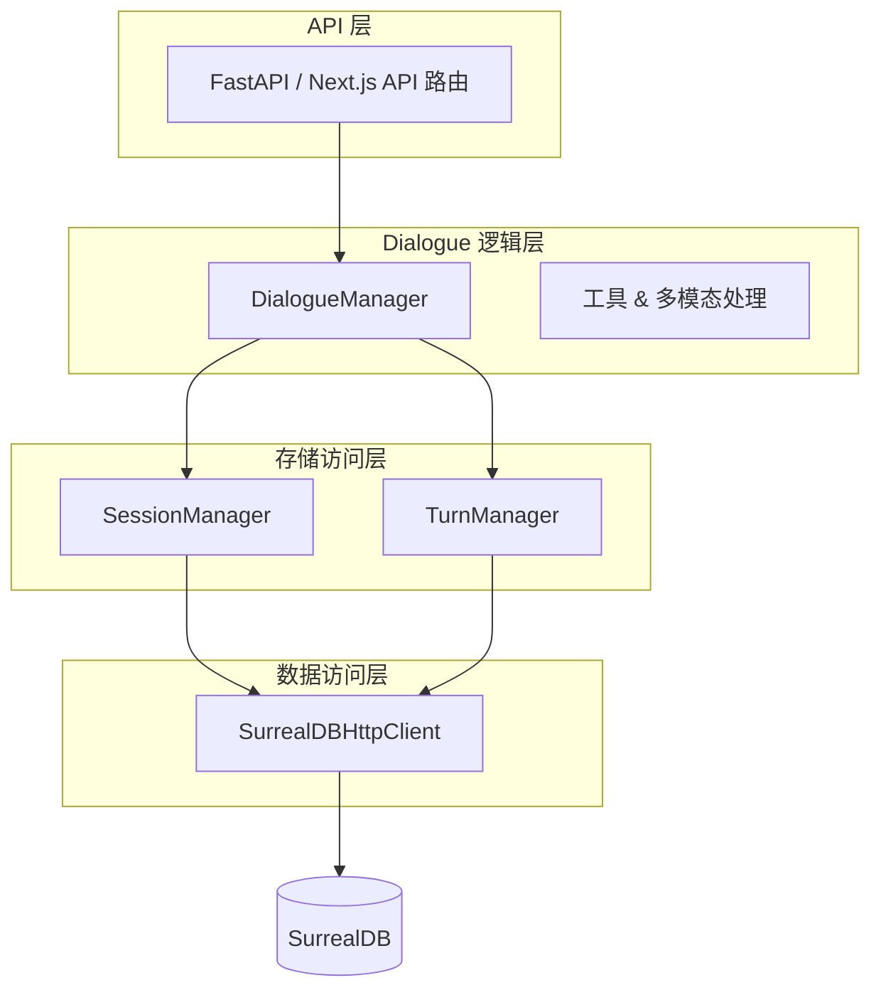

# 对话持久化到 SurrealDB 的完整实施方案

> 适用范围：Rainbow AI Agent 项目阶段四及之后版本

---

## 1. 目标

在 **系统级对话流程** 中，将所有会话 (sessions) 与轮次 (turns) **实时、可靠** 地写入 SurrealDB，并支持后续查询、分析及多模态检索。

---

## 2. 总体架构



* **DialogueManager**：集中处理消息流与对话类型逻辑，负责调用 Session/Turn Manager 持久化。
* **SessionManager / TurnManager**：表结构初始化、数据对象映射 (Model)、缓存、CRUD。
* **SurrealDBHttpClient**：通过 HTTP REST & SQL `/sql` 接口执行真正的 DB 操作。

---

## 3. 数据模型概览

| 表 | 主字段 | 描述 |
|----|--------|------|
| `sessions` | `id`(PK)、`user_id`、`dialogue_type`、`title`、`created_at/updated_at/last_activity_at`、`summary`、`topics[]`、`sentiment`、`metadata{}` | 会话元信息 |
| `turns` | `id`(PK)、`session_id`(FK)、`role`(user/assistant/…)、`content`、`created_at`、`embedding[]`、`metadata{}` | 每条对话消息 |

### 字段规范
* 所有时间字段采用 ISO-8601 字符串保存，SurrealDB 自动映射为 `datetime`。
* 嵌套对象/数组字段 (`metadata`/`topics`/`embedding`) 直接 JSON 格式传输。
* `embedding` 仅在需要向量检索时写入；否则可为空。

---

## 4. 关键改造点

### 4.1 把手工 SQL 插入改为 HTTP JSON

```python
# BEFORE (简化)
sql = self._build_insert_sql("sessions", data)
self.client.execute_sql(sql)

# AFTER
created = self.client.create_record("sessions", data["id"], data)
```

* 同步接口对应 `client.create_record`，异步调用可包一层 `await asyncio.to_thread(...)` 或新增 `create_record_async`。
* 替换位置：`SessionManager.create_session`、`TurnManager.create_turn`。

### 4.2 DialogueManager 集成示例

```python
async def process_message(self, user_id: str, content: str, session_id: str | None = None):
    # 1) 创建 / 获取会话
    if not session_id:
        session = await self.session_mgr.create_session(user_id)
        session_id = session["id"]

    # 2) 保存用户轮次
    await self.turn_mgr.create_turn(session_id, role="user", content=content)

    # 3) 获取 AI 回复 (调用代理)
    reply = await self.agent.respond(content)

    # 4) 保存 AI 轮次
    await self.turn_mgr.create_turn(session_id, role="assistant", content=reply)

    # 5) 更新会话活动
    await self.session_mgr.record_activity(session_id)

    return reply, session_id
```

> **注意**：`TurnManager.create_turn` 建议也改为 `async` API，避免阻塞 I/O。

### 4.3 错误处理 & 重试

* 所有 `client.*` 调用捕获 `requests.exceptions.*` 或连接错误；记录日志、立刻重试最多 *N* 次 (默认 3)。
* 若连续失败，可将消息暂存于 Redis / 本地队列，后台任务异步重写入。

### 4.4 缓存策略

* `SessionManager._session_cache` & `TurnManager._turn_cache` 用于**热数据**；
* TTL (默认 60 秒) + LRU 淘汰，防止内存膨胀；
* 更新/删除时同步刷新缓存。

### 4.5 表结构迁移脚本

Manager 初次调用会自动 `DEFINE TABLE`。若生产环境需显式迁移，可在 `scripts/setup_surreal_tables.py` 中统一执行。

---

## 5. 测试计划

1. **单元测试** (`tests/test_dialogue_storage.py`)
   * 覆盖 CRUD ➜ OK
2. **集成测试** `test_dialogue_flow_surreal.py`
   * 模拟多轮对话；断言 `sessions` 与 `turns` 表实际记录数 == 本地消息数。
3. **压力测试**
   * `locust` / `k6` 模拟并发对话 1000 req/s，观察 SurrealDB TPS 与延迟。

---

## 6. 部署与运维

| 项目 | 建议 |
|------|------|
| **SurrealDB** | 1.2.0 以上版本；启用 WAL；CPU ≥ 2c，内存 ≥ 4 GB。|
| **备份** | 每日全量导出 (`surreal export`) + 增量日志快照。|
| **监控** | Prometheus exporter (`/metrics`)；重点指标：`surreal_queries_total`, `surreal_latency_seconds`。|
| **安全** | SurrealDB 7823 端口仅内网开放；生产使用 HTTPS 反向代理；`root` 账户改为最小权限。|

---

## 7. 里程碑

| 序号 | 内容 | 负责人 | 截止 |
|------|------|--------|------|
| M1 | 替换 SQL 插入为 `create_record` | @backend | 06-05 |
| M2 | DialogueManager 写入集成 & 单元测试通过 | @backend | 06-06 |
| M3 | 集成 / 压测报告 | @qa | 06-07 |
| M4 | 部署生产 & 监控面板上线 | @devops | 06-08 |

---

## 8. 附：常见问题 FAQ

| 问题 | 解决方案 |
|------|----------|
| SurrealDB 报 `PARSE ERROR` | 检查手写 SQL；优先使用 HTTP JSON 接口。|
| 长连接断开 / 超时 | HTTP 模式天然短连接；可启用 `keep-alive`；或降级为 WebSocket + 自动重连。|
| 多线程并发写冲突 | HTTP 接口无状态；确保 `id` 唯一即可，无明显冲突。|

---

> 文档版本：v1.0 (2025-06-02)
